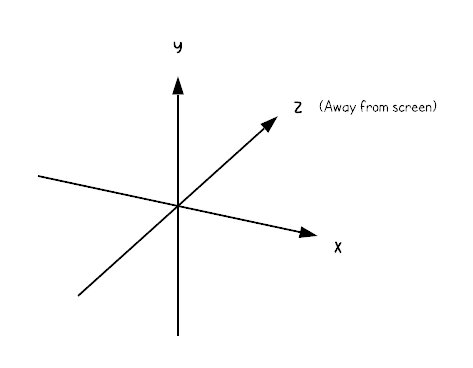
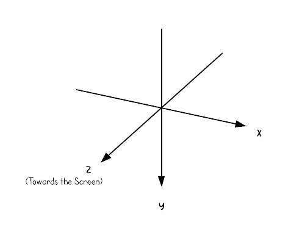

### Translating Coordinate System

Translate Left hand coordinate system used in Unity3D, to Right Hand coordinate system, following the convention of OpenCV (standard Computer Vison camera look orientation).

D:\ML\Self Driving Car\self_driving_car\Self-Driving-Car-Python\Self Driving Car\neural_rendering

 -> 

Get the transform matrix from Unity3D, and flip the values of Y and Z for translation vector only.

### Transform Matrix (camera intrinsic matrix)

$$
\begin{bmatrix}
R & t  \\
0 & 1  \\
\end{bmatrix}
\=
\begin{bmatrix}
r_{11} & r_{11} & r_{11} & t_{x} \\
r_{21} & r_{22} & r_{23} & t_{y} \\
r_{31} & r_{32} & r_{33} & t_{z} \\
0 & 0 & 0 & 1 \\
\end{bmatrix}
$$

This homogeneous transformation is composed out of R, a $$3 \times 3$$ Rotation matrix, and t, a $$3 \times 1$$ Translation vector (repsenting the camera position).
The row is a homogeneous space of $$(0, 0, 0, 1)$$.

### How is Rotation Matrix created?

Let says, we rotate our object in x-ais by 15, y axis by 20,
i.e.,  
$$r_x = 15, r_y = 20$$
Then, our $$R_x$$ matrix will look like:

$$
R_x \=
\begin{bmatrix}
1 & 0 & 0 \\
0 & cos(r_x) & -sin(r_x) \\
0 & sin(r_x) & cos(r_x) \\
\end{bmatrix}
\=
\begin{bmatrix}
1 & 0 & 0 \\
0 & 0.966 & -0.259 \\
0 & 0.259 & 0.966 \\
\end{bmatrix}
$$

And similarly, 

$$
R_y \=
\begin{bmatrix}
cos(r_x) & 0 & -sin(r_x) \\
0 & 1 & 0 \\
sin(r_x) & 0 & cos(r_x) \\
\end{bmatrix}
\=
\begin{bmatrix}
0.940 & 0 & 0.342 \\
0 & 1 & 0 \\
-0.342 & 0 & 0.940 \\
\end{bmatrix}
$$

and,

$$
R_z \=
\begin{bmatrix}
1 & 0 & 0 \\
0 & 1 & 0 \\
0 & 0 & 1 \\
\end{bmatrix}
$$

Then, to convert Euler to Rotation Matrix,

$$
R = R_y \cdot (R_x \cdot R_z) \= \begin{bmatrix}
0.940 & 0.088 & 0.330 \\
0 & 0.966 & -0259 \\
-0.342 & 0.243 & 0.908 \\
\end{bmatrix}
$$

Next step is to flip the values if Y and Z in the rotation matrix to align with the standard Computer Vison orientation.
