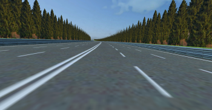
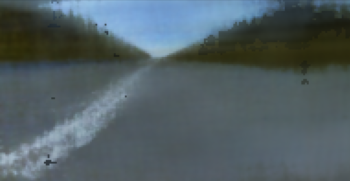
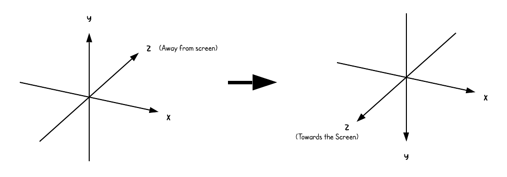

## Neural Rendering with NeRF

1) Data Collection: Drive the car in the simulation, and capture image of the road in front of the car and the camera transform matrix (translation vector and rotation matrix)
2) Feed the data into Small NeRF architecture to learn the 3D representation of the road environment.
3) Render an image from the hold-out test image. The model was trained for 3000 iterations, and rendered the following results:

| Original Image from Data Collection | Rendered Image from NeRF |
|------------------|------------------------|
|  |  |

### Analysis and Observations

#### Observations

During testing, the model successfully reconstructed the global geometry by accurately placing the road, trees, and sky in their place, but the final output remained blurry. The PSNR stabilized around 18, suggesting that while the spatial layout was learned, high-frequency details were not fully captured.

#### Analysis

1) The Small NeRF MLP architecture acted as a low-pass filter. It captured the coarse shapes but lacked the weights to represent fine textures.

2) At 3000 iterations, the model provides a successful proof-of-concept for the Simulation to rendering pipeline. Standard NeRF models require 50,000+ iterations to resolve sharp details.

3) Despite the blur, all features (road, sky, trees) are in their correct geometric positions, proving that the coordinate translation from Unity to the Neural volume was successful.

## Coordinate System Alignment

Unity3D uses a Left-Handed coordinate system ($+Y$ up, $+Z$ forward), whereas standard Computer Vision (OpenCV/NeRF) uses a Right-Handed convention. To ensure the neural renderer correctly interprets the camera's perspective, we perform a coordinate basis translation.

Get the transform matrix from Unity3D, and flip the values of Y and Z for translation vector only.

### Transform Matrix (Camera Extrinsic Properties)

The camera's position and orientation are represented by a $4 \times 4$ homogeneous transformation matrix, combining the $3 \times 3$ Rotation matrix ($R$) and the $3 \times 1$ Translation vector ($t$):

$$
\begin{bmatrix}
R & t  \\
0 & 1  \\
\end{bmatrix}
\=
\begin{bmatrix}
r_{11} & r_{12} & r_{13} & t_{x} \\
r_{21} & r_{22} & r_{23} & t_{y} \\
r_{31} & r_{32} & r_{33} & t_{z} \\
0 & 0 & 0 & 1 \\
\end{bmatrix}
$$

The row is a homogeneous space of $$(0, 0, 0, 1)$$.

### How is Rotation Matrix created?

To convert Unity’s Euler angles ($r_x, r_y, r_z$) into this rotation matrix, we calculate the individual rotation matrices for each axis and multiply them in the specific order used by the simulation engine:

Let says, we rotate our object in x-axis by 15, y axis by 20, i.e., $$r_x = 15, r_y = 20$$
Then, our $$R_x$$ matrix will look like:

$$
R_x \=
\begin{bmatrix}
1 & 0 & 0 \\
0 & cos(r_x) & -sin(r_x) \\
0 & sin(r_x) & cos(r_x) \\
\end{bmatrix}
\=
\begin{bmatrix}
1 & 0 & 0 \\
0 & 0.966 & -0.259 \\
0 & 0.259 & 0.966 \\
\end{bmatrix}
$$

And, 

$$
R_y \=
\begin{bmatrix}
cos(r_y) & 0 & sin(r_y) \\
0 & 1 & 0 \\
-sin(r_y) & 0 & cos(r_y) \\
\end{bmatrix}
\=
\begin{bmatrix}
0.940 & 0 & 0.342 \\
0 & 1 & 0 \\
-0.342 & 0 & 0.940 \\
\end{bmatrix}
$$

And,

$$
R_z \=
\begin{bmatrix}
1 & 0 & 0 \\
0 & 1 & 0 \\
0 & 0 & 1 \\
\end{bmatrix}
$$

Then, to convert Euler to Rotation Matrix,

$$
R = R_y \cdot (R_x \cdot R_z) \= \begin{bmatrix}
0.940 & 0.088 & 0.330 \\
0 & 0.966 & -0.259 \\
-0.342 & 0.243 & 0.908 \\
\end{bmatrix}
$$

Next step is to flip the values of Y and Z in the rotation matrix to align with the standard Computer Vision orientation.
